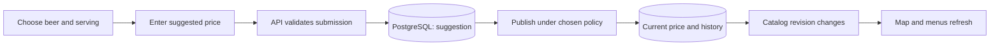

# Price suggestions and browser verification plan

Status: implemented locally after the user's instruction to start. See
[setup and verification](price-suggestions.md) for the shipped behavior.
Branch: `feature/price-reports`, based on `origin/main` at `8f73cf6`.

## Purpose and current state

Users will select an existing beer/serving, enter a suggested new price in the
app, and submit it. The API saves the suggestion in PostgreSQL. Publishing that
change updates the displayed menu, map price, price bands and price-per-litre
ranking without a rebuild or a Git commit.

PostgreSQL has a concrete responsibility here: durable user submissions, current
prices, update history and transactional conflict handling. Before this feature
it stored only a seeded catalog document. A static catalog alone would not
require a database.

The current repository layout is `application/`, `infrastructure/`, `playwright/`
and `docs/`. The existing browser script is
`application/scripts/check-mobile-interactions.mjs`; it already exercises price
filters, litre sorting, several venues, keyboard focus, mobile menus, the time
slider and map failure recovery. Extend this coverage rather than discard it.

## Publication decision

Submission always writes to PostgreSQL immediately. The remaining decision is
when the proposed price becomes the map's displayed price:

- Recommended: save it as pending; a signed-in reviewer accepts or rejects it.
  Acceptance publishes the price. Pending submissions do not replace verified
  prices.
- Alternative: publish immediately as a clearly labelled community suggestion.
  Preserve the last verified quote and its source; do not describe a user entry
  as verified research. An operator can revert an incorrect update.

Implemented the recommended pending/reviewer flow as the stated default, since
no contrary publication preference was supplied before implementation. Users
enter changes themselves; the API validates and persists them immediately.

## 1. Establish a stable serving identity

Keep existing venue IDs and exact serving distinctions: beer name, volume,
multipack and from-price semantics. Add a persistent serving ID, assigned once
and retained through price changes. Do not identify a serving by its price or
array position. Detect ambiguous duplicate source entries during import rather
than silently bind a report to the wrong item.

Expose that ID as an additive API field. Preserve existing sourced venue files,
opening hours and catalog semantics; a price-report feature is not a full data
model rewrite. Initially support price corrections for existing servings only.

## 2. Add durable data with additive SQL migrations

| Proposed table | Responsibility |
| --- | --- |
| `beer_map_servings` | Stable IDs mapped to existing venue/serving identities |
| `beer_map_price_suggestions` | Proposed price, target ID, observed price/version, optional note/evidence URL, status and timestamps |
| `beer_map_current_prices` | Published override for a serving, provenance, source suggestion and revision |
| `beer_map_price_changes` | Append-only old/new values and publication/reversal history |

Retain `beer_map_catalog` as the sourced baseline. Apply published overrides
when constructing its API projection. Repeated setup or reseeding must preserve
user suggestions and published overrides. Add indexes for serving lookups and
pending-review queries, foreign keys and price/status constraints.

Store money as integer EUR cents. Parse comma or dot decimal input explicitly;
reject negative, zero, excessive precision and out-of-range input under a
documented limit. Do not silently round or cap a submitted price.

## 3. Implement the write API and publication transaction

Add a price-suggestion endpoint accepting serving ID, proposed price and the
price revision shown to the user. Resolve the existing serving on the server;
do not trust client-supplied venue names, old prices or publication status.

Bound request size, validate input, parameterize SQL and deduplicate retried
submissions using an idempotency key. Rate-limit submissions with enforcement
that works across app instances. Check request origin for browser writes and
apply CSRF protection wherever cookie authentication grants authority.

Use narrowly scoped database permissions for submissions and publication;
the web process must not use the migration/database-owner identity. Anonymous
visitors may submit suggestions without introducing a full account system.
Reviewer/reversal actions require server-validated authentication; never embed
an admin credential in the browser or accept an unprotected approval endpoint.

Publishing locks/checks the current serving revision and atomically records the
history, changes the displayed price, updates suggestion status and bumps the
catalog revision. A stale competing edit needs explicit conflict handling; it
must not silently overwrite a newer accepted price. Rejecting a pending report
leaves the published price unchanged. A reversal records a new history event.

## 4. Add the price-suggestion interaction

Put “Suggest a price” beside an individual serving in the venue menu, reachable
from both the list and map detail. Show the beer, serving size and current price
so users know precisely what they are editing.

The form contains the new price, an optional note and evidence link. Preserve
the entered value on validation/network errors; show pending/success/failure
states and prevent accidental double submission. Keyboard navigation, focus
return, mobile placement and readable errors are part of acceptance.

Explain whether submission is awaiting review or published as community data.
Do not mark an entire venue or its old research date as newly verified because
one serving received a suggestion. Render user text safely; do not fetch arbitrary
submitted URLs on the server. Image uploads and public user profiles are outside
the first version.

If review is chosen, include a small authenticated review screen with the old
and proposed price, serving, evidence and accept/reject controls. It is required
for a usable moderation flow, not deferred after building the public form.

## 5. Make published changes visible consistently

Use a numeric catalog revision to invalidate the composed snapshot only when
displayed data changes. Preserve content-based ETags and unchanged 304 handling;
a pending suggestion alone does not invalidate the public catalog.

The submitting page revalidates after a published update. Other visible clients
check periodically, proposed at 30 seconds, and on focus/manual refresh. Avoid
WebSockets for this small feature. Retain search, price band, sort, selected bar,
menu scroll and keyboard focus while refreshing. Recompute all price-dependent
labels/rankings from the same new snapshot. A failed refresh keeps the previous
valid catalog with an explicit notice.

Serve browser catalog responses with revalidation-friendly caching so a CDN
cannot serve an old price for the existing one-hour stale window. Publication
metadata is per serving; community and verified sources stay distinguishable.

## 6. Write repeatable Playwright coverage

Keep a runnable local `npm run test:browser` entry point in `application/`, where
the Playwright dependency is installed. Organize scenario modules in the root
`playwright/` directory; the application runner supplies browser/fixture helpers.
Leave every `.github/` workflow unchanged.

Run against a dedicated local app and disposable PostgreSQL test database with
deterministic fixtures. The write scenarios must never run against public
Aluskarte or another live database. Do not mock the database-backed success path.

The browser script will:

1. Load the map and verify its catalog and usable controls.
2. Change price bands, search for venues/beers and change price/litre/name sort.
3. Open ALA, Swings and another bar; check menus, exact serving sizes, multipacks,
   unknown-volume presentation, source links, map/list selection and closing.
4. Exercise zoom, the time filter, empty results, keyboard focus and mobile menus.
5. Submit a real suggested price through the form and confirm its PostgreSQL row.
6. Exercise the selected publication policy. If moderated, verify pending does
   not alter the map, then approve through the authenticated reviewer UI.
7. Verify the new price, litre value and filter/sort membership in another browser
   context, and persistence after a reload. Verify rejected/conflicting updates
   do not incorrectly replace the price.
8. Test invalid prices, repeated submission, unauthorized review, request failure
   and catalog recovery without losing the user's selection or form input.

Use stable accessible locators and observable response/UI waits. Save a trace
and screenshot on failure; avoid fixed sleeps as the synchronization strategy.
Use genuine serving fixtures for regression checks without changing live prices.

## 7. Verify the database and finish the feature locally

Add focused real-SQL checks for repeatable migrations, cents handling,
idempotency, constraints, authorization, two competing updates, transactional
rollback and cache revision behavior. Keep destructive fixtures isolated.
Run existing lint/types/data checks and the full browser scenarios at desktop
and phone sizes. Check the production Docker build and persistence after restart.
Record exactly what passed; do not equate a build with a tested user flow.

Document setup, local test commands, publication/reversal behavior and the
PostgreSQL rationale. Commit implementation in reviewed slices only after the
user authorizes work; create its PR when requested. Do not merge automatically.

## Boundaries

- The initial planning turn created only the branch and this plan. The user
  subsequently authorized implementation; feature code and local tests are now
  included. Pipeline changes remain outside scope.
- Implement on `feature/price-reports` from the latest restructured `main`, not
  the older GKE branch. Do not reintroduce removed native/cloud machinery.
- Expected implementation locations: application routes/UI/database/scripts,
  local PostgreSQL configuration if required, Playwright scenarios and docs.
- No changes to CI workflows, deployment automation or unrelated research.
- Target local Docker/PostgreSQL first. File-only mode cannot persist suggestions
  and must expose that capability honestly. Existing Cloudflare hosting is a
  separate deployment decision; this plan does not make its public site writable.
- No GCP provisioning, public deployment, new scheduled task or extra paid service.

Publication currently uses reviewer approval, as described above. Changing that
policy is a separate product decision.
